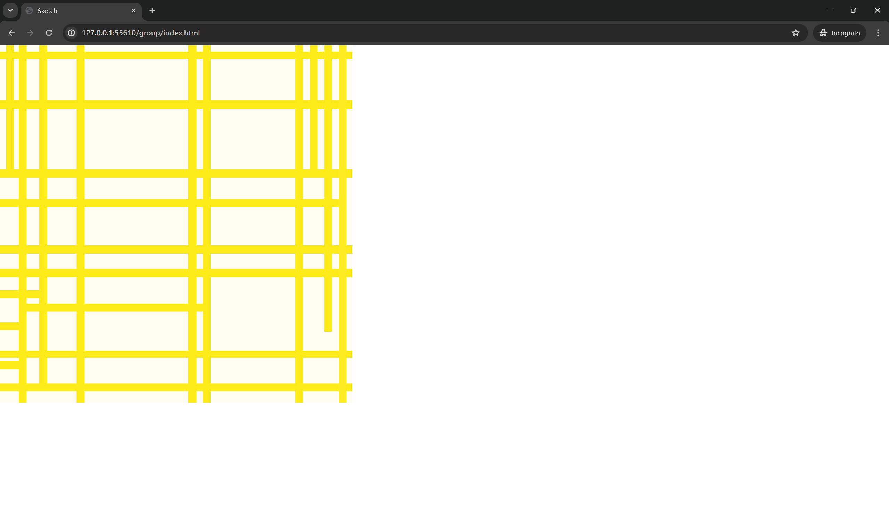
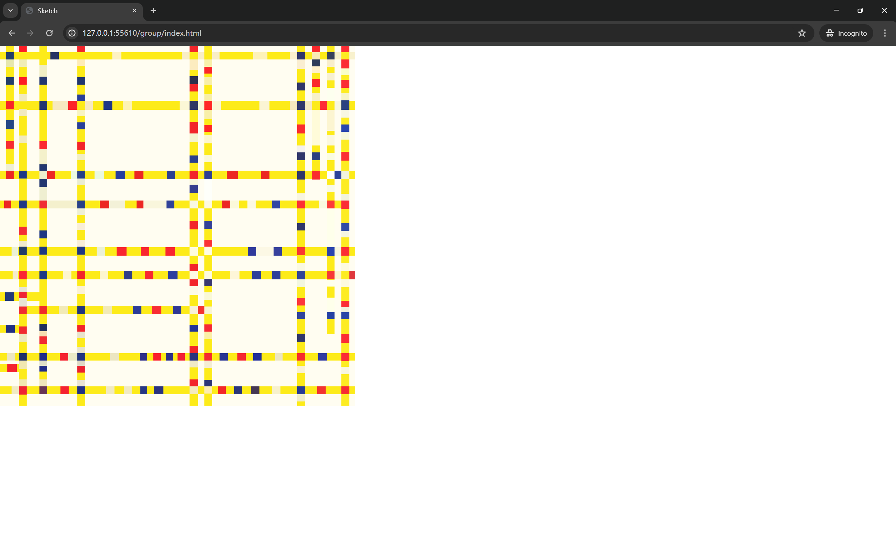
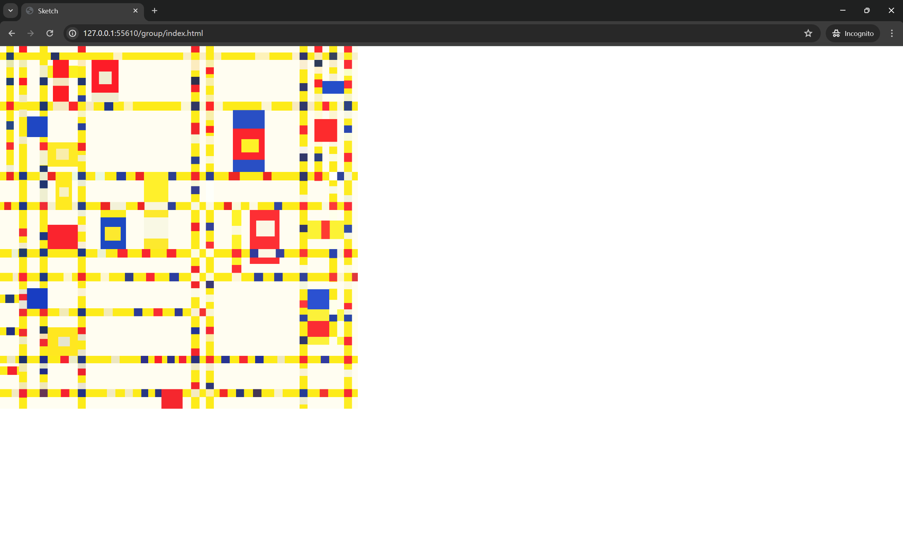
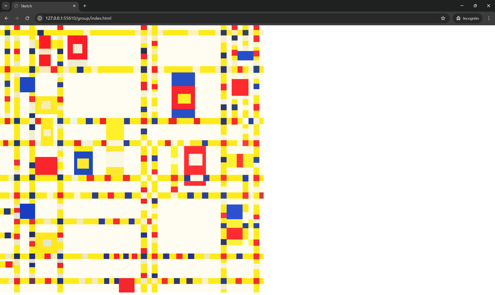
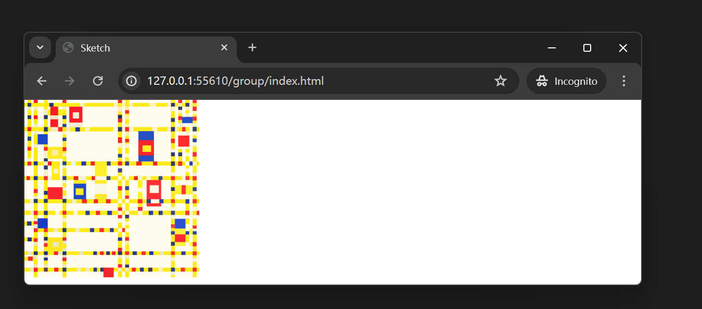
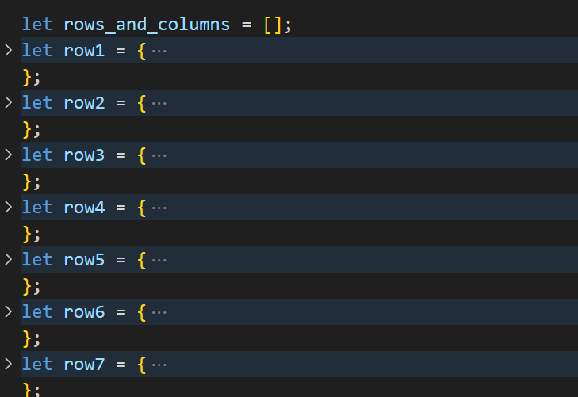
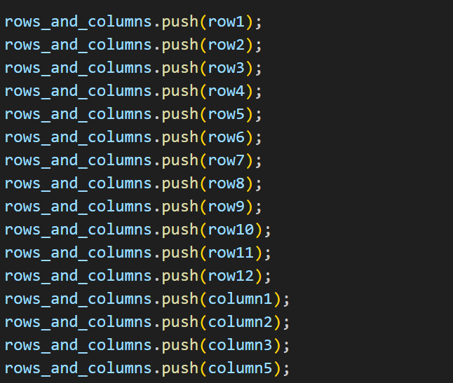
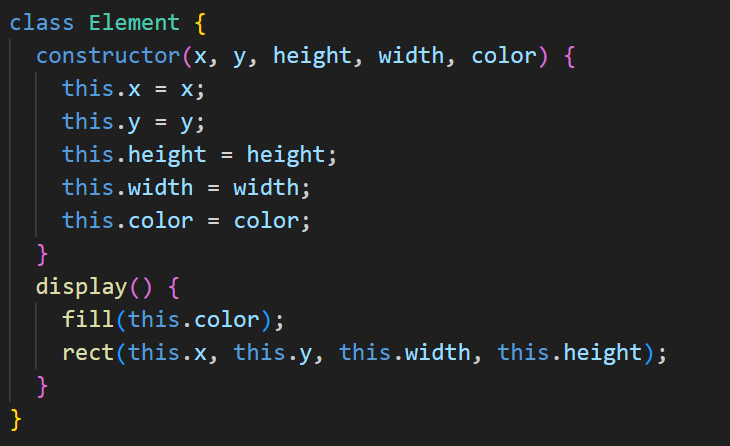
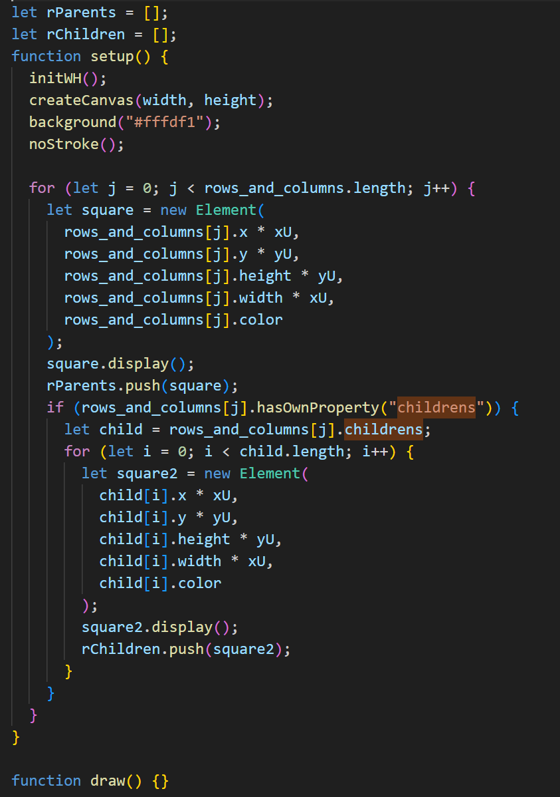
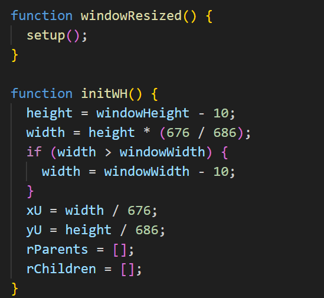

## Implementation

1. Stage 1
   1. Complete the skeleton of the entire pattern
   2. 
2. Stage 2
   1. Fill the skeleton with elements
   2. 
3. Stage 3
   1. Supplement remaining graphic elements
   2. 
4. Stage 4
   1. Implement responsive design, where the pattern adjusts according to the window size
   2. 
   3. 

## Technical overview


1. In the implementation code of the group section, each rectangle in the pattern skeleton is treated as a parent element object, and the small rectangles contained in the rectangle are treated as child element objects. Therefore, the parent element object is treated as the following structure. Simultaneously save all parent elements using an array.

   ```js
   let row1 = {
     color: "#fdeb19",
     width: width,
     height: 14,
     x: 0,
     y: 12,
     childrens: [
       {
         color: "#273364",
         x: 96,
         width: 16,
         height: 14,
         y: 12,
       },
      ...
     ],
   };
   ```

   The partial code structure is as follows:

   

2. Each graphic will be treated as an Element object, which can facilitate the subsequent writing of individual parts. The following is the basic Element Class
   

3. In the setup function, render each shape sequentially according to the parent-child relationship, where initWH() is explained in the next section

   

4. In the adaptive adjustment pattern code, since the width and height were initially fixed, initWH() uses simple mathematical calculations to obtain the current scaling size and adjust the actual values of width and height appropriately. It also calls the setup function to initialize every time the window size changes. The code for adaptively adjusting the overall pattern size is as follows:
   

## GitHub links

> This section should contain the full name and Unikey of each group member and a link to their GitHub repository containing their final submission. Check the week 8 tutorial to make sure you provide the correct link, and make sure you verify the links are correct before you submit.